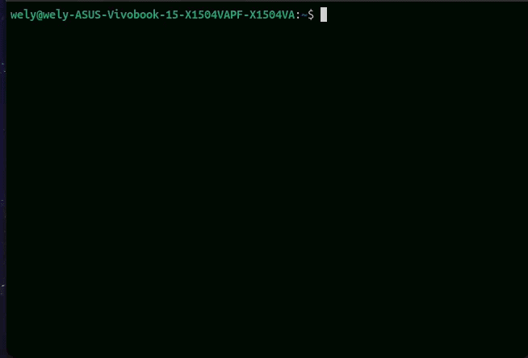

#Dustman 🧹

Dustman is a Command Line Interface bulding using Python designed to scan and checking the temporary files and remove the temporary files to freed up space and keep the system running smoothly.




## Key Features

- **Easy to use**: Simple CLI menu to scan and check temporary files.
- **Fast cleanup**: Deletes temporary files quicklyز
- **Safe scanning**: Checks files before removing them to keep the system safe.
- **Linux Support**: Runs smoothly on Linux systems.

## Installation

Install Dustman directly from GitHub via `pipx`:

```bash
pipx install git+https://github.com/alwaleed-gh/DUSTMAN.git
```
If you don't have pipx installed, install it first:

```bash
sudo apt install pipx
pipx ensurepath
```


## Usage

After installation, launch Dustman directly from your terminal:

```bash
dustman
```
